# CAB SYSTEM

---

# B1. XÁC ĐỊNH STAKEHOLDER

| STT | Stakeholder | Vai trò |
|---:|---|---|
| 1 | Khách hàng | Người sử dụng hệ thống để đăng ký, đăng nhập, cập nhật thông tin cá nhân, nhập điểm đón và điểm đến, lựa chọn loại xe, lựa chọn tài xế khả dụng, theo dõi chuyến đi và xem lịch sử chuyến. |
| 2 | Tài xế | Người nhận và thực hiện chuyến xe; quản lý hồ sơ, thông tin phương tiện, vị trí và trạng thái hoạt động; chấp nhận hoặc từ chối yêu cầu chuyến và cập nhật trạng thái chuyến đi. |
| 3 | Nhân viên vận hành | Theo dõi hoạt động của khách hàng, tài xế và chuyến đi; hỗ trợ xử lý các trường hợp phát sinh. Trong MVP chưa phát triển thành module riêng. |
| 4 | Ban lãnh đạo / Quản lý doanh nghiệp | Định hướng hoạt động của hệ thống, xác định phạm vi MVP và theo dõi hiệu quả vận hành của CAB System. |
| 5 | Nhà cung cấp thanh toán bên ngoài | Bên liên quan được khách hàng yêu cầu cho định hướng thanh toán điện tử trong tương lai; chưa triển khai trong MVP hiện tại. |
| 6 | Nhà cung cấp dịch vụ thông báo | Cung cấp các kênh gửi thông báo cho khách hàng và tài xế trong định hướng mở rộng; chưa triển khai trong MVP hiện tại. |
| 7 | Business Analyst (BA) | Làm rõ các yêu cầu chưa được chốt với các bên liên quan và xác định phạm vi, tác nhân, quy trình nghiệp vụ, yêu cầu chức năng, phi chức năng, Business Rules và các trường hợp ngoại lệ. |
| 8 | Nhóm phát triển hệ thống | Phân tích kỹ thuật, thiết kế, xây dựng, kiểm thử và triển khai CAB System dựa trên các yêu cầu đã được xác định. |

---

# B2. STAKEHOLDER MATRIX

## 2.1. Stakeholder Matrix

| Stakeholder | Influence | Interest | Chiến lược quản lý |
|---|---|---|---|
| Customer | Low | High | Keep Informed |
| Driver | Low | High | Keep Informed |
| Operation Staff | High | High | Manage Closely |
| Management | High | High | Manage Closely |
| Business Analyst | High | High | Manage Closely |
| Development Team | High | High | Manage Closely |
| Payment Provider | High | Low | Keep Satisfied |
| Notification Provider | Medium | Low | Keep Satisfied |

## 2.2. Stakeholder Matrix Diagram

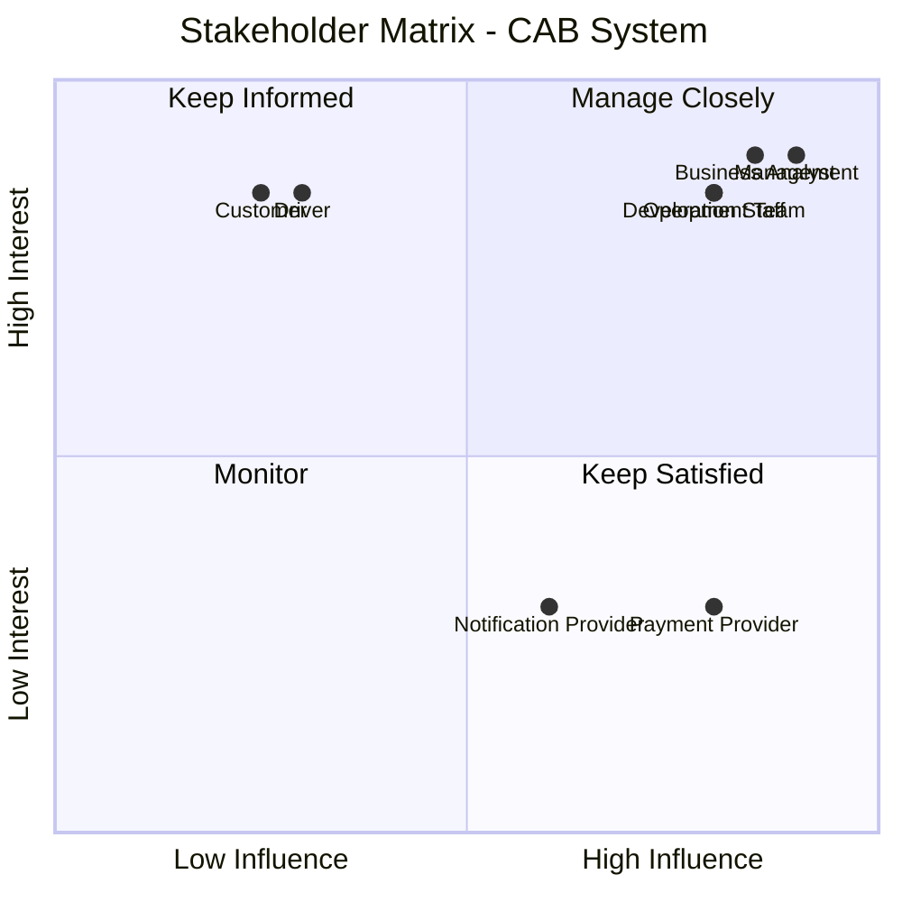

---

# B3 -- Chuyển đổi yêu cầu khách hàng thành mục tiêu nghiệp vụ

> Để tránh trùng mã với Business Requirement ở B5, mục tiêu nghiệp vụ
> dùng mã **BR-Gxx** (Business Requirement -- Goal).

  -----------------------------------------------------------------------
  Mã                      Yêu cầu/nhu cầu khách   Mục tiêu nghiệp vụ
                          hàng                    
  ----------------------- ----------------------- -----------------------
  **BR-G01**              Khách hàng cần tài      Xây dựng chức năng quản
                          khoản và cập nhật thông lý tài khoản và hồ sơ
                          tin cá nhân.            Customer.

  **BR-G02**              Khách hàng cần nhập     Số hóa quy trình tạo
                          điểm đón, điểm đến và   Ride Request.
                          gửi yêu cầu đặt xe.     

  **BR-G03**              Khách hàng muốn lựa     Cho phép Customer xem
                          chọn loại xe.           và chọn Vehicle Type
                                                  phù hợp.

  **BR-G04**              Hệ thống cần tìm tài xế Lọc Driver theo điều
                          phù hợp; MVP không cần  kiện cơ bản và cho
                          tài xế "tốt nhất".      Customer chủ động lựa
                                                  chọn Driver.

  **BR-G05**              Tài xế cần quản lý hồ   Xây dựng chức năng quản
                          sơ, phương tiện, trạng  lý Driver phục vụ quá
                          thái và vị trí.         trình nhận chuyến.

  **BR-G06**              Tài xế cần chấp nhận    Xây dựng cơ chế Trip
                          hoặc từ chối chuyến.    Offer và phản hồi
                                                  ACCEPT/REJECT.

  **BR-G07**              Nếu Driver từ chối,     Cho phép Customer lựa
                          khách hàng không phải   chọn Driver khác trên
                          tạo lại yêu cầu.        Ride Request hiện tại.

  **BR-G08**              Khách hàng khó theo dõi Quản lý vòng đời Trip
                          trạng thái chuyến.      và hiển thị trạng thái
                                                  hiện tại cho Customer.

  **BR-G09**              Customer và Driver cần  Lưu và cung cấp lịch sử
                          xem lại chuyến đã thực  Trip theo đúng quyền
                          hiện.                   truy cập.
  -----------------------------------------------------------------------

------------------------------------------------------------------------

# B4 -- Phạm vi MVP

Từ các mục tiêu nghiệp vụ ở B3, dự án được giới hạn còn **2 module
chính**.

## M-01 -- Quản lý khách hàng

Bao gồm:

-   Đăng ký tài khoản Customer.
-   Đăng nhập/đăng xuất.
-   Xem và cập nhật hồ sơ.
-   Nhập điểm đón và điểm đến.
-   Xem và lựa chọn loại xe.
-   Tạo Ride Request.
-   Xem danh sách Driver phù hợp.
-   Tự lựa chọn Driver.
-   Theo dõi Trip.
-   Xem lịch sử Trip.

## M-02 -- Quản lý tài xế

Bao gồm:

-   Đăng nhập/đăng xuất.
-   Xem và cập nhật hồ sơ.
-   Cập nhật trạng thái hoạt động.
-   Cập nhật vị trí.
-   Xem phương tiện đang sử dụng.
-   Xem Trip Offer.
-   ACCEPT/REJECT Trip Offer.
-   Xem Trip được phân công.
-   Cập nhật trạng thái Trip.
-   Xem lịch sử Trip.

## Nguyên tắc MVP

1.  Giai đoạn này **không cần xác định "tài xế tốt nhất"**.
2.  Không xây dựng thuật toán AI/ML hoặc ranking Driver.
3.  Hệ thống chỉ lọc Driver theo hai điều kiện cốt lõi:
    -   Driver đang ở trạng thái `AVAILABLE`.
    -   Vehicle Type của Driver phù hợp với Vehicle Type Customer đã
        chọn.
4.  Customer tự lựa chọn Driver từ danh sách phù hợp.
5.  Driver có quyền `ACCEPT` hoặc `REJECT`.
6.  Nếu Driver `REJECT`, Customer chọn Driver khác mà không phải tạo lại
    Ride Request.
7.  Trip chỉ được tạo khi Driver `ACCEPT`.

## Ngoài phạm vi MVP

-   Tính cước.
-   Thanh toán tiền mặt/điện tử.
-   Payment Gateway.
-   Rating/đánh giá Driver.
-   Notification đa kênh.
-   Báo cáo doanh thu và dashboard nâng cao.
-   AI/ML Driver Matching.
-   Xếp hạng/ưu tiên "tài xế tốt nhất".
-   Dynamic Pricing.
-   Voucher/Promotion/Loyalty.
-   Chính sách hủy chuyến nâng cao.
-   Ride Sharing và Scheduled Ride.

------------------------------------------------------------------------

# B5 -- Business Requirements

  -----------------------------------------------------------------------
  Mã BR                               Business Requirement
  ----------------------------------- -----------------------------------
  **BR-01**                           Hệ thống phải cho phép Customer
                                      đăng ký, đăng nhập, đăng xuất, xem
                                      và cập nhật hồ sơ cá nhân.

  **BR-02**                           Hệ thống phải cho phép Driver quản
                                      lý hồ sơ, trạng thái hoạt động, vị
                                      trí và phương tiện đang sử dụng.

  **BR-03**                           Hệ thống phải cho phép Customer tạo
                                      Ride Request với điểm đón, điểm đến
                                      và Vehicle Type hợp lệ.

  **BR-04**                           Hệ thống phải cho phép Customer xem
                                      và lựa chọn Vehicle Type trước khi
                                      lựa chọn Driver.

  **BR-05**                           Hệ thống phải hiển thị các Driver
                                      đang `AVAILABLE` và có Vehicle Type
                                      phù hợp với Ride Request.

  **BR-06**                           Hệ thống phải cho phép Customer tự
                                      lựa chọn một Driver phù hợp và tạo
                                      Trip Offer gửi đến Driver đó.

  **BR-07**                           Hệ thống phải cho phép Driver xem
                                      Trip Offer của mình và `ACCEPT`
                                      hoặc `REJECT`; khi REJECT, Customer
                                      có thể chọn Driver khác mà không
                                      tạo lại Ride Request.

  **BR-08**                           Hệ thống phải tạo và quản lý Trip
                                      sau khi Driver ACCEPT, đồng thời
                                      cho phép Customer theo dõi trạng
                                      thái chuyến.

  **BR-09**                           Hệ thống phải lưu Trip đã hoàn
                                      thành và cho phép Customer/Driver
                                      xem lịch sử Trip thuộc quyền của
                                      mình.
  -----------------------------------------------------------------------

------------------------------------------------------------------------

# B6 -- Mô hình hóa nghiệp vụ

Có **9 BR → 9 Business Process**.

## BP-01 -- Customer Account Management (BR-01)

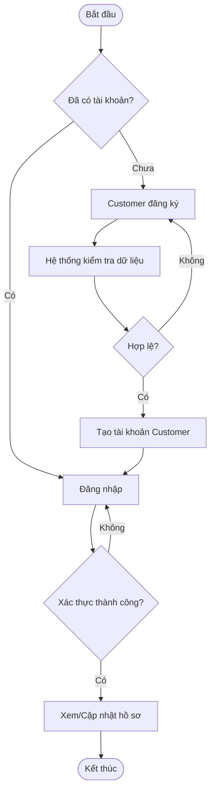

## BP-02 -- Driver Management (BR-02)

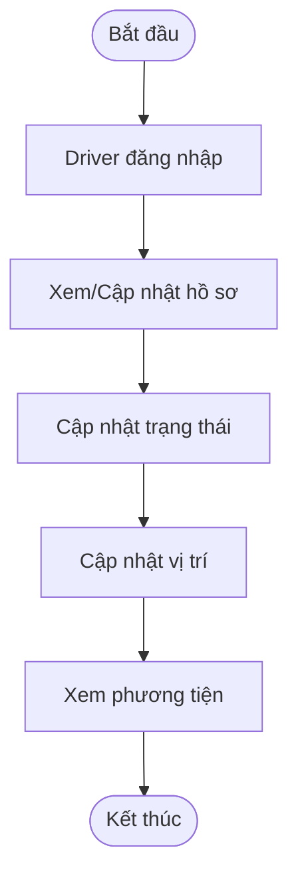

## BP-03 -- Create Ride Request (BR-03)

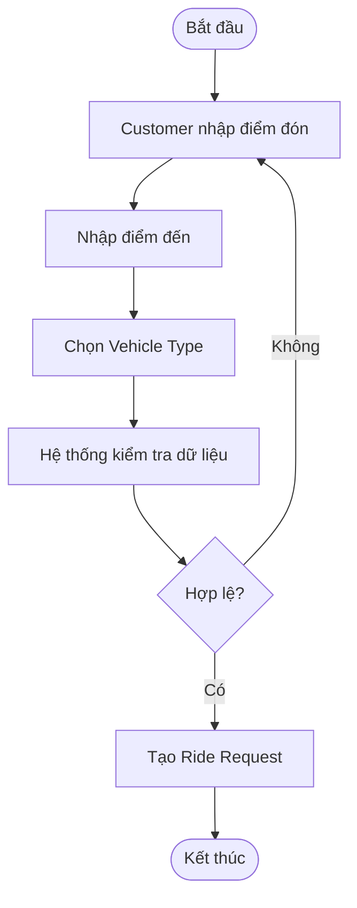

## BP-04 -- Select Vehicle Type (BR-04)

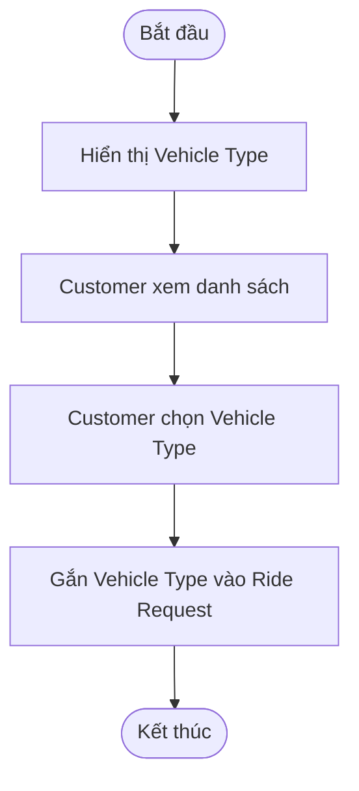

## BP-05 -- View Available Drivers (BR-05)

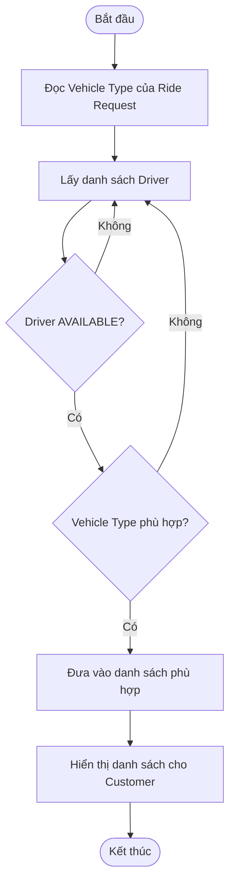

## BP-06 -- Select Driver (BR-06)

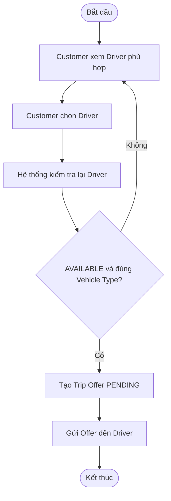

## BP-07 -- Driver Responds to Trip Offer (BR-07)

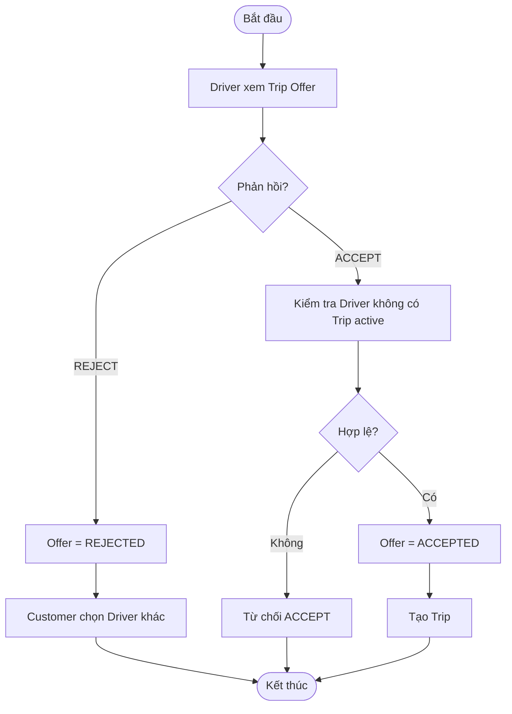

## BP-08 -- Trip Execution (BR-08)

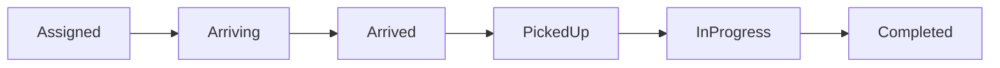

## BP-09 -- Trip History (BR-09)

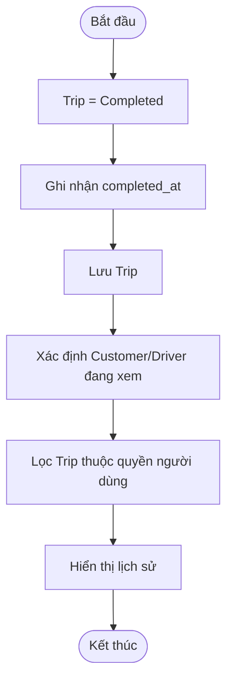

------------------------------------------------------------------------

# B7 -- Functional Requirements

## FR-01 -- Customer Account

  Mã FR          Functional Requirement
  -------------- -------------------------------------------------------
  **FR-01.01**   Cho phép Customer đăng ký tài khoản.
  **FR-01.02**   Cho phép Customer đăng nhập bằng thông tin hợp lệ.
  **FR-01.03**   Cho phép người dùng đăng xuất.
  **FR-01.04**   Cho phép Customer xem hồ sơ của mình.
  **FR-01.05**   Cho phép Customer cập nhật thông tin hồ sơ được phép.

## FR-02 -- Driver Management

  Mã FR          Functional Requirement
  -------------- ------------------------------------------------
  **FR-02.01**   Cho phép Driver xem hồ sơ của mình.
  **FR-02.02**   Cho phép Driver cập nhật hồ sơ.
  **FR-02.03**   Cho phép Driver cập nhật trạng thái hoạt động.
  **FR-02.04**   Cho phép Driver cập nhật vị trí.
  **FR-02.05**   Cho phép Driver xem phương tiện đang sử dụng.

## FR-03 -- Ride Request

  Mã FR          Functional Requirement
  -------------- -------------------------------------------------
  **FR-03.01**   Cho phép Customer nhập điểm đón.
  **FR-03.02**   Cho phép Customer nhập điểm đến.
  **FR-03.03**   Kiểm tra các dữ liệu bắt buộc của Ride Request.
  **FR-03.04**   Tạo Ride Request khi dữ liệu hợp lệ.

## FR-04 -- Vehicle Type

  -----------------------------------------------------------------------
  Mã FR                               Functional Requirement
  ----------------------------------- -----------------------------------
  **FR-04.01**                        Hiển thị danh sách Vehicle Type
                                      được hỗ trợ.

  **FR-04.02**                        Cho phép Customer chọn một Vehicle
                                      Type cho Ride Request.
  -----------------------------------------------------------------------

## FR-05 -- Available Drivers

  -----------------------------------------------------------------------
  Mã FR                               Functional Requirement
  ----------------------------------- -----------------------------------
  **FR-05.01**                        Xác định Driver có trạng thái
                                      `AVAILABLE`.

  **FR-05.02**                        Lọc Driver có Vehicle Type phù hợp
                                      Ride Request.

  **FR-05.03**                        Hiển thị danh sách Driver phù hợp
                                      để Customer lựa chọn.
  -----------------------------------------------------------------------

## FR-06 -- Driver Selection

  -----------------------------------------------------------------------
  Mã FR                               Functional Requirement
  ----------------------------------- -----------------------------------
  **FR-06.01**                        Cho phép Customer lựa chọn Driver.

  **FR-06.02**                        Kiểm tra lại trạng thái và Vehicle
                                      Type của Driver tại thời điểm lựa
                                      chọn.

  **FR-06.03**                        Tạo Trip Offer ở trạng thái
                                      `PENDING`.

  **FR-06.04**                        Gửi Trip Offer đến đúng Driver được
                                      Customer lựa chọn.
  -----------------------------------------------------------------------

## FR-07 -- Trip Offer

  -----------------------------------------------------------------------
  Mã FR                               Functional Requirement
  ----------------------------------- -----------------------------------
  **FR-07.01**                        Cho phép Driver xem Trip Offer gửi
                                      cho mình.

  **FR-07.02**                        Cho phép Driver `ACCEPT` Trip
                                      Offer.

  **FR-07.03**                        Cho phép Driver `REJECT` Trip
                                      Offer.

  **FR-07.04**                        Tạo Trip khi Trip Offer được
                                      `ACCEPT`.

  **FR-07.05**                        Cho phép Customer chọn Driver khác
                                      nếu Offer bị `REJECT`.
  -----------------------------------------------------------------------

## FR-08 -- Trip

  -----------------------------------------------------------------------
  Mã FR                               Functional Requirement
  ----------------------------------- -----------------------------------
  **FR-08.01**                        Cho phép Customer và Driver liên
                                      quan xem thông tin Trip.

  **FR-08.02**                        Cho phép Driver được phân công cập
                                      nhật Trip status.

  **FR-08.03**                        Kiểm tra thứ tự chuyển trạng thái
                                      Trip.

  **FR-08.04**                        Cho phép Customer theo dõi trạng
                                      thái Trip hiện tại.

  **FR-08.05**                        Ghi nhận Trip hoàn thành khi trạng
                                      thái là `Completed`.
  -----------------------------------------------------------------------

## FR-09 -- Trip History

  Mã FR          Functional Requirement
  -------------- ----------------------------------------------
  **FR-09.01**   Lưu Trip đã hoàn thành vào lịch sử.
  **FR-09.02**   Cho phép Customer xem lịch sử Trip của mình.
  **FR-09.03**   Cho phép Driver xem lịch sử Trip của mình.

------------------------------------------------------------------------

# B8 -- Business Rules

  ----------------------------------------------------------------------------------------------------------
  Mã                                  Business Rule
  ----------------------------------- ----------------------------------------------------------------------
  **RULE-01**                         Người dùng phải được xác thực trước khi sử dụng chức năng yêu cầu tài
                                      khoản.

  **RULE-02**                         Người dùng chỉ được thực hiện chức năng phù hợp với vai trò của mình.

  **RULE-03**                         Ride Request phải có điểm đón và điểm đến.

  **RULE-04**                         Customer phải chọn Vehicle Type trước khi xem Driver phù hợp.

  **RULE-05**                         Chỉ Driver có trạng thái `AVAILABLE` mới được hiển thị cho Customer
                                      lựa chọn.

  **RULE-06**                         Vehicle Type của Driver phải phù hợp Vehicle Type của Ride Request.

  **RULE-07**                         Trong MVP, Customer trực tiếp chọn Driver; hệ thống không xếp hạng
                                      hoặc tự chọn "Driver tốt nhất".

  **RULE-08**                         Một Driver không được có nhiều Trip đang hoạt động cùng lúc.

  **RULE-09**                         Driver chỉ được ACCEPT/REJECT Trip Offer gửi cho chính mình.

  **RULE-10**                         Khi Driver REJECT, Ride Request vẫn được giữ để Customer lựa chọn
                                      Driver khác.

  **RULE-11**                         Trip chỉ được tạo sau khi Driver ACCEPT Trip Offer.

  **RULE-12**                         Chỉ Driver được phân công mới được cập nhật trạng thái Trip.

  **RULE-13**                         Trip phải chuyển trạng thái theo đúng thứ tự
                                      `Assigned → Arriving → Arrived → PickedUp → InProgress → Completed`.

  **RULE-14**                         Trip đã `Completed` không được chuyển ngược về trạng thái trước.

  **RULE-15**                         Customer và Driver chỉ được xem Trip/History thuộc quyền của mình.

  **RULE-16**                         Khi Driver thực hiện Trip, trạng thái Driver phải phản ánh việc không
                                      còn sẵn sàng nhận Trip khác; sau khi hoàn tất có thể trở lại
                                      `AVAILABLE`.
  ----------------------------------------------------------------------------------------------------------

### Driver Status

`OFFLINE → ONLINE → AVAILABLE → BUSY → AVAILABLE`

### Trip Offer Status

`PENDING → ACCEPTED` hoặc `PENDING → REJECTED`

### Trip Status

`Assigned → Arriving → Arrived → PickedUp → InProgress → Completed`

------------------------------------------------------------------------

# B9 -- Non-Functional Requirements

  -----------------------------------------------------------------------
  Mã NFR                  Nhóm                    Yêu cầu
  ----------------------- ----------------------- -----------------------
  **NFR-01**              Performance             Các thao tác thông
                                                  thường nên phản hồi
                                                  trong vòng ≤ 3 giây
                                                  trong điều kiện tải
                                                  bình thường.

  **NFR-02**              Performance             Danh sách Driver phù
                                                  hợp phải được truy xuất
                                                  đủ nhanh để không làm
                                                  gián đoạn quy trình đặt
                                                  xe.

  **NFR-03**              Security                Mật khẩu phải được bảo
                                                  vệ và không lưu dưới
                                                  dạng plaintext.

  **NFR-04**              Security                API/chức năng được bảo
                                                  vệ phải yêu cầu xác
                                                  thực hợp lệ.

  **NFR-05**              Security                Hệ thống phải kiểm soát
                                                  quyền truy cập theo vai
                                                  trò.

  **NFR-06**              Security                Dữ liệu cá nhân, phương
                                                  tiện và vị trí phải
                                                  được bảo vệ khỏi truy
                                                  cập trái phép.

  **NFR-07**              Reliability             Cập nhật Driver status,
                                                  Trip Offer và Trip
                                                  status phải đảm bảo
                                                  tính nhất quán.

  **NFR-08**              Reliability             Hệ thống phải hạn chế
                                                  việc tạo nhiều Trip
                                                  active cho cùng Driver
                                                  khi có thao tác đồng
                                                  thời.

  **NFR-09**              Availability            Lỗi ở một chức năng
                                                  không nên làm ngừng
                                                  toàn bộ quy trình đặt
                                                  xe.

  **NFR-10**              Scalability             Thiết kế phải cho phép
                                                  mở rộng số lượng
                                                  Customer và Driver
                                                  trong tương lai.

  **NFR-11**              Maintainability         Hai module
                                                  Customer/Driver phải
                                                  được tổ chức rõ ràng để
                                                  dễ bảo trì và mở rộng.

  **NFR-12**              Usability               Luồng nghiệp vụ phải
                                                  rõ: tạo yêu cầu → chọn
                                                  loại xe → xem/chọn
                                                  Driver → Driver phản
                                                  hồi → thực hiện Trip.

  **NFR-13**              Usability               Thông báo lỗi phải cho
                                                  biết dữ liệu thiếu/sai
                                                  hoặc thao tác không hợp
                                                  lệ.

  **NFR-14**              Auditability            Các thao tác quan trọng
                                                  liên quan đến trạng
                                                  thái Driver, Trip Offer
                                                  và Trip cần có khả năng
                                                  lưu vết.

  **NFR-15**              Compatibility           Giao diện web phải hỗ
                                                  trợ các trình duyệt
                                                  hiện đại phổ biến.
  -----------------------------------------------------------------------

------------------------------------------------------------------------

# B10 -- Xác định ERD Entity

## B10.1. Danh sách Entity

  Entity            Mục đích
  ----------------- ----------------------------------------------------------
  **User**          Lưu thông tin xác thực, vai trò và trạng thái tài khoản.
  **Customer**      Lưu hồ sơ Customer.
  **Driver**        Lưu hồ sơ, trạng thái và vị trí Driver.
  **VehicleType**   Lưu loại xe Customer có thể lựa chọn.
  **Vehicle**       Lưu phương tiện của Driver.
  **RideRequest**   Lưu yêu cầu đặt xe.
  **TripOffer**     Lưu yêu cầu nhận chuyến gửi đến Driver.
  **Trip**          Lưu chuyến đi sau khi Driver ACCEPT.

## B10.2. ERD

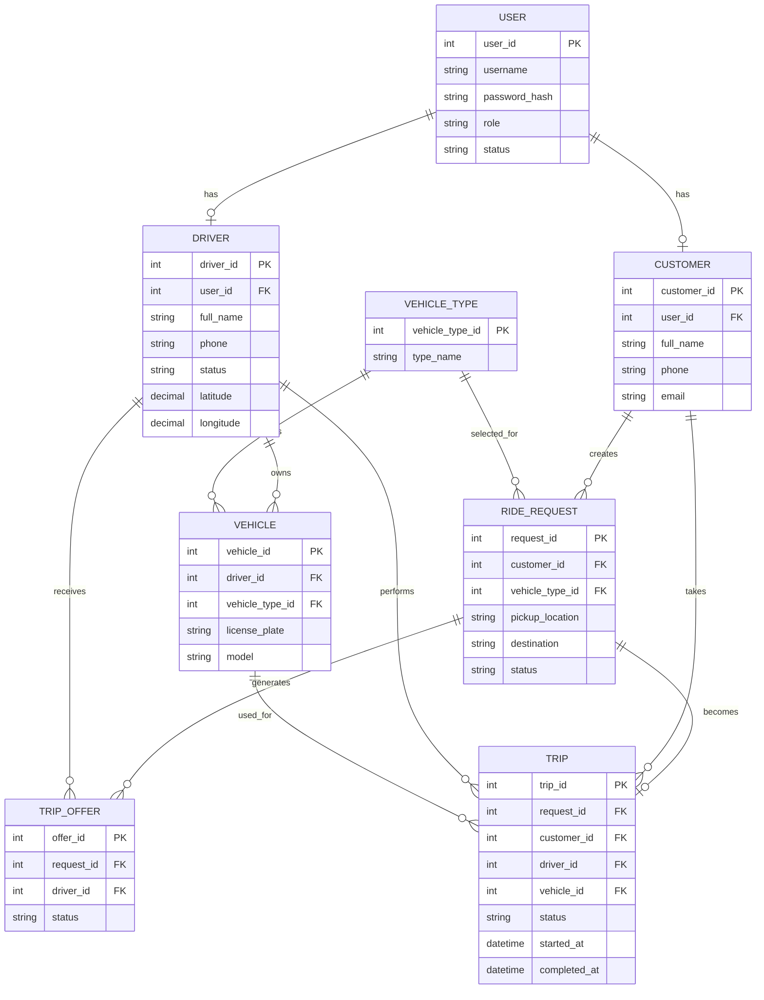

------------------------------------------------------------------------

# B11 -- Thiết kế Use Case

## B11.1. Danh sách Use Case

  -----------------------------------------------------------------------
  UC                Tên Use Case      Actor             FR liên quan
  ----------------- ----------------- ----------------- -----------------
  **UC-01**         Đăng ký tài khoản Customer          FR-01.01
                    Customer                            

  **UC-02**         Đăng nhập         Customer, Driver  FR-01.02

  **UC-03**         Đăng xuất         Customer, Driver  FR-01.03

  **UC-04**         Xem hồ sơ         Customer, Driver  FR-01.04,
                                                        FR-02.01

  **UC-05**         Cập nhật hồ sơ    Customer, Driver  FR-01.05,
                                                        FR-02.02

  **UC-06**         Cập nhật trạng    Driver            FR-02.03
                    thái Driver                         

  **UC-07**         Cập nhật vị trí   Driver            FR-02.04
                    Driver                              

  **UC-08**         Xem phương tiện   Driver            FR-02.05

  **UC-09**         Tạo Ride Request  Customer          FR-03.01 →
                                                        FR-03.04

  **UC-10**         Chọn Vehicle Type Customer          FR-04.01 →
                                                        FR-04.02

  **UC-11**         Xem Driver phù    Customer          FR-05.01 →
                    hợp                                 FR-05.03

  **UC-12**         Chọn Driver       Customer          FR-06.01 →
                                                        FR-06.04

  **UC-13**         Xem Trip Offer    Driver            FR-07.01

  **UC-14**         Phản hồi Trip     Driver            FR-07.02 →
                    Offer                               FR-07.05

  **UC-15**         Xem Trip          Customer, Driver  FR-08.01,
                                                        FR-08.04

  **UC-16**         Cập nhật trạng    Driver            FR-08.02,
                    thái Trip                           FR-08.03,
                                                        FR-08.05

  **UC-17**         Xem lịch sử Trip  Customer, Driver  FR-09.01 →
                                                        FR-09.03
  -----------------------------------------------------------------------

## B11.2. Use Case Mermaid

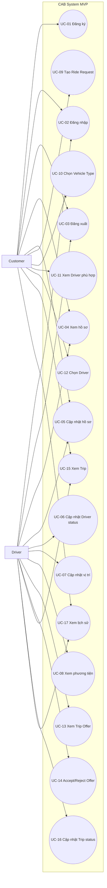

------------------------------------------------------------------------

# B12 -- Acceptance Criteria

  -----------------------------------------------------------------------
  AC                      FR                      Tiêu chí chấp nhận
  ----------------------- ----------------------- -----------------------
  **AC-01.01**            FR-01.01                Given dữ liệu đăng ký
                                                  hợp lệ, when Customer
                                                  đăng ký, then hệ thống
                                                  tạo tài khoản Customer
                                                  thành công.

  **AC-01.02**            FR-01.02                Given tài khoản hợp lệ,
                                                  when Customer đăng nhập
                                                  đúng thông tin, then hệ
                                                  thống xác thực thành
                                                  công.

  **AC-01.03**            FR-01.03                Given người dùng đã
                                                  đăng nhập, when đăng
                                                  xuất, then phiên/token
                                                  hiện tại không còn được
                                                  sử dụng như phiên hợp
                                                  lệ.

  **AC-01.04**            FR-01.04                Customer chỉ xem được
                                                  hồ sơ thuộc tài khoản
                                                  của mình.

  **AC-01.05**            FR-01.05                Dữ liệu hồ sơ hợp lệ
                                                  được cập nhật thành
                                                  công.

  **AC-02.01**            FR-02.01                Driver đã xác thực xem
                                                  được đúng hồ sơ của
                                                  mình.

  **AC-02.02**            FR-02.02                Driver cập nhật được
                                                  các trường hồ sơ được
                                                  phép.

  **AC-02.03**            FR-02.03                Driver cập nhật được
                                                  trạng thái thuộc tập
                                                  trạng thái hợp lệ.

  **AC-02.04**            FR-02.04                Latitude/longitude hợp
                                                  lệ được ghi nhận cho
                                                  Driver.

  **AC-02.05**            FR-02.05                Driver xem được Vehicle
                                                  thuộc mình; nếu chưa có
                                                  thì hệ thống trả danh
                                                  sách rỗng.

  **AC-03.01**            FR-03.01                Không tạo Ride Request
                                                  nếu thiếu pickup
                                                  location.

  **AC-03.02**            FR-03.02                Không tạo Ride Request
                                                  nếu thiếu destination.

  **AC-03.03**            FR-03.03                Dữ liệu thiếu hoặc sai
                                                  bị từ chối với thông
                                                  báo phù hợp.

  **AC-03.04**            FR-03.04                Ride Request hợp lệ
                                                  được tạo và gắn đúng
                                                  Customer.

  **AC-04.01**            FR-04.01                Hệ thống trả danh sách
                                                  Vehicle Type hiện có.

  **AC-04.02**            FR-04.02                Vehicle Type Customer
                                                  chọn phải tồn tại và
                                                  được gắn đúng Ride
                                                  Request.

  **AC-05.01**            FR-05.01                Driver không ở
                                                  `AVAILABLE` không xuất
                                                  hiện trong danh sách
                                                  lựa chọn.

  **AC-05.02**            FR-05.02                Driver có Vehicle Type
                                                  không phù hợp không
                                                  xuất hiện.

  **AC-05.03**            FR-05.03                Nếu không có Driver phù
                                                  hợp, hệ thống trả danh
                                                  sách rỗng; không tự
                                                  chọn Driver sai điều
                                                  kiện.

  **AC-06.01**            FR-06.01                Customer lựa chọn được
                                                  một Driver từ danh sách
                                                  phù hợp.

  **AC-06.02**            FR-06.02                Nếu Driver không còn
                                                  AVAILABLE tại thời điểm
                                                  xác nhận, lựa chọn bị
                                                  từ chối.

  **AC-06.03**            FR-06.03                Lựa chọn hợp lệ tạo
                                                  đúng Trip Offer
                                                  `PENDING`.

  **AC-06.04**            FR-06.04                Trip Offer được gắn
                                                  đúng Ride Request và
                                                  Driver Customer đã
                                                  chọn.

  **AC-07.01**            FR-07.01                Driver chỉ xem được
                                                  Trip Offer gửi cho
                                                  mình.

  **AC-07.02**            FR-07.02                ACCEPT hợp lệ cập nhật
                                                  Offer thành `ACCEPTED`.

  **AC-07.03**            FR-07.03                REJECT hợp lệ cập nhật
                                                  Offer thành `REJECTED`.

  **AC-07.04**            FR-07.04                Trip chỉ được tạo sau
                                                  ACCEPT và liên kết đúng
                                                  Customer, Driver, Ride
                                                  Request và Vehicle.

  **AC-07.05**            FR-07.05                Sau REJECT, Customer có
                                                  thể chọn Driver khác mà
                                                  không tạo lại Ride
                                                  Request.

  **AC-08.01**            FR-08.01                Customer/Driver liên
                                                  quan xem được Trip;
                                                  người không liên quan
                                                  bị từ chối.

  **AC-08.02**            FR-08.02                Chỉ Driver được phân
                                                  công được cập nhật Trip
                                                  status.

  **AC-08.03**            FR-08.03                Hệ thống từ chối chuyển
                                                  Trip status sai thứ tự.

  **AC-08.04**            FR-08.04                Customer xem được trạng
                                                  thái Trip mới nhất.

  **AC-08.05**            FR-08.05                Sau `Completed`, Trip
                                                  được ghi nhận hoàn
                                                  thành và không được
                                                  chuyển ngược.

  **AC-09.01**            FR-09.01                Trip Completed được lưu
                                                  để truy xuất lịch sử.

  **AC-09.02**            FR-09.02                Customer chỉ xem lịch
                                                  sử Trip của mình.

  **AC-09.03**            FR-09.03                Driver chỉ xem lịch sử
                                                  Trip do mình thực hiện.
  -----------------------------------------------------------------------

------------------------------------------------------------------------

# B13 -- Bảng truy vết

  ----------------------------------------------------------------------------
  Mục tiêu    Business      Business    Functional    Use Case    Acceptance
  nghiệp vụ   Requirement   Process     Requirement               Criteria
  ----------- ------------- ----------- ------------- ----------- ------------
  BR-G01      BR-01         BP-01       FR-01.01 →    UC-01 →     AC-01.01 →
                                        FR-01.05      UC-05       AC-01.05

  BR-G05      BR-02         BP-02       FR-02.01 →    UC-04 →     AC-02.01 →
                                        FR-02.05      UC-08       AC-02.05

  BR-G02      BR-03         BP-03       FR-03.01 →    UC-09       AC-03.01 →
                                        FR-03.04                  AC-03.04

  BR-G03      BR-04         BP-04       FR-04.01 →    UC-10       AC-04.01 →
                                        FR-04.02                  AC-04.02

  BR-G04      BR-05         BP-05       FR-05.01 →    UC-11       AC-05.01 →
                                        FR-05.03                  AC-05.03

  BR-G04      BR-06         BP-06       FR-06.01 →    UC-12       AC-06.01 →
                                        FR-06.04                  AC-06.04

  BR-G06,     BR-07         BP-07       FR-07.01 →    UC-13,      AC-07.01 →
  BR-G07                                FR-07.05      UC-14       AC-07.05

  BR-G08      BR-08         BP-08       FR-08.01 →    UC-15,      AC-08.01 →
                                        FR-08.05      UC-16       AC-08.05

  BR-G09      BR-09         BP-09       FR-09.01 →    UC-17       AC-09.01 →
                                        FR-09.03                  AC-09.03
  ----------------------------------------------------------------------------

## Chuỗi truy vết

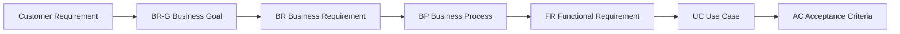

------------------------------------------------------------------------

# B14 -- Test Case

**Chưa thực hiện trong giai đoạn hiện tại.**

Test Case sẽ được xây dựng ở giai đoạn kiểm thử dựa trên:

-   Business Requirements.
-   Functional Requirements.
-   Business Rules.
-   Use Cases.
-   Acceptance Criteria.
-   API Specification sau khi được thiết kế.
-   Các nhóm kiểm thử Positive, Negative, Boundary, Empty và Invalid
    Format/Type.

------------------------------------------------------------------------

# Các vấn đề cần xác nhận ở giai đoạn sau

Các yêu cầu khách hàng ban đầu còn một số nội dung chưa chốt như tiêu
chí ưu tiên Driver, thời gian phản hồi, chính sách hủy chuyến, xử lý mất
kết nối và thời gian lưu trữ dữ liệu. Các nội dung này **không được tự
giả định thành Business Rule trong MVP hiện tại** và cần được BA xác
nhận với stakeholder trước khi mở rộng hệ thống.
